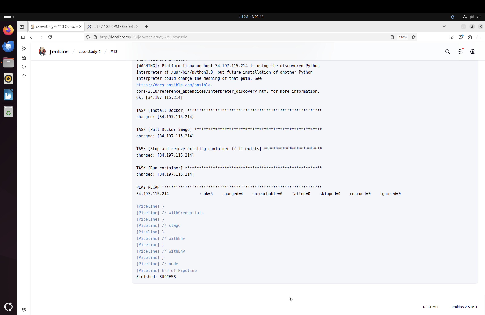
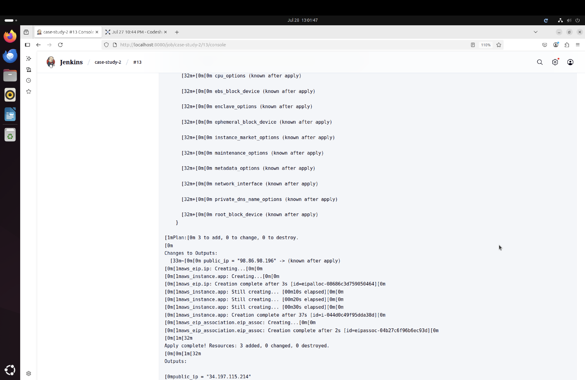
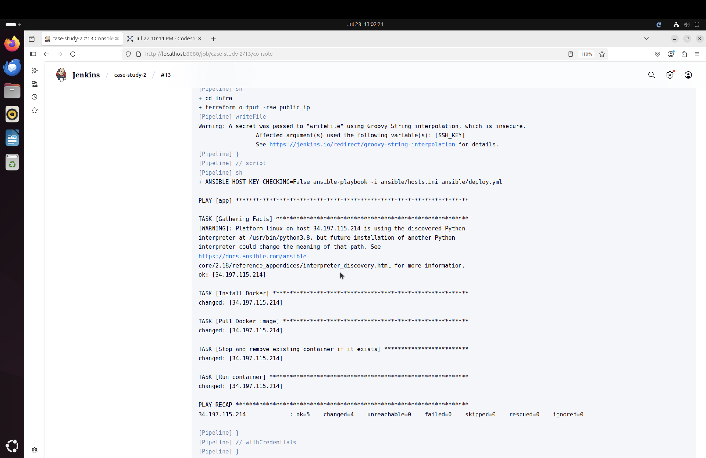
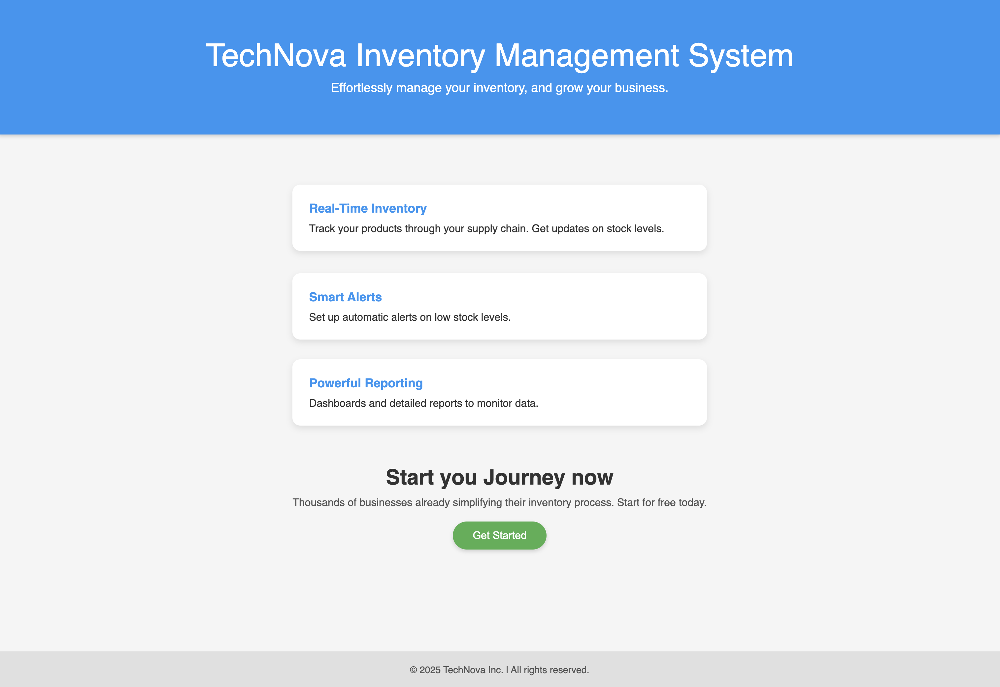

# REPORT.md

## Architecture Diagram

```
+--------------------+
|    GitHub Repo     |
|(Code & Jenkinsfile)|
+--------------------+
          |
          v
+--------------------+
|      Jenkins       |
|  (CI/CD Pipeline)  |
+--------------------+
          |
          v
+--------------------+
|     Terraform      |
| Provision AWS Infra|
+--------------------+
          |
          v
+--------------------+
|      AWS EC2       |
| (t2.micro instance)|
+--------------------+
          |
          v
+--------------------+
|     Ansible        |
| Configure & Deploy |
+--------------------+
          |
          v
+--------------------+
|     Docker         |
| Containerized App  |
+--------------------+
          |
          v
+--------------------+
|  Node.js App Live  |
|   (Port 80→3000)   |
+--------------------+
```

---

## Branching Strategy

- **`main`**: Protected, production-ready branch.
- **`develop`**: Default development branch.
- PRs must go through `develop` → `main`, requiring code review.
- Feature branches are created off `develop`.

```bash
git checkout -b develop
```

---

## Terraform Resource Summary

Terraform (in `infra/`) provisions:

| Resource             | Description                             |
|----------------------|-----------------------------------------|
| `aws_vpc`            | Custom VPC                              |
| `aws_subnet`         | Public subnet in VPC                    |
| `aws_security_group` | Allows SSH (22) and HTTP (80) traffic   |
| `aws_instance`       | EC2 t2.micro with Elastic IP            |
| `aws_eip`            | Static IP for persistent public access  |

Commands:
```bash
cd infra
terraform init
terraform apply -auto-approve
```

Uses input variables:
- `region = "us-east-1"` (or your chosen region)
- `instance_type = "t2.micro"`

---

## Jenkins CI/CD Pipeline

### Jenkinsfile Stages:

1. **Checkout Code** from `develop`
2. **Build & Dockerize**:
   ```bash
   ./scripts/build_and_push.sh
   ```
   - Builds image: `docker.io/pborade90/myapp:<commit_hash>`
   - Pushes to DockerHub

3. **Terraform Apply**:
   - Creates or updates infra via `terraform apply`

4. **Ansible Deployment**:
   - Installs Docker on EC2
   - Pulls container image from DockerHub
   - Runs container mapping port 80 to 3000

### Sample Image Tag

```bash
IMAGE="pborade90/myapp:$GIT_COMMIT"
```

### Trigger Example

Push a change to `src/index.js` → merge into `develop` → pipeline auto-triggers.

---

## Shell Scripting & Cleanup

### `scripts/build_and_push.sh`

```bash
#!/usr/bin/env bash
set -euo pipefail

IMAGE="yourdockerhubusername/myapp:$GIT_COMMIT"
echo "Building Docker image $IMAGE"
docker build -t $IMAGE .
echo "Pushing Docker image to DockerHub..."
docker push $IMAGE
```

### `scripts/cleanup.sh`

```bash
#!/usr/bin/env bash
set -euo pipefail

echo "[CLEANUP] Removing dangling images..."
docker image prune -f

echo "[CLEANUP] Removing unused containers/networks..."
docker container prune -f
docker network prune -f
```

Both scripts include strict error handling and verbose logging.

---

## Pipeline Execution Logs / Screenshots

### Jenkins CI/CD Execution


### Terraform Apply Output


### Ansible Deployment


### Live App in Browser

